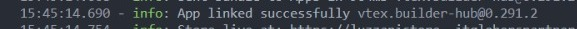

# Store Theme Sodimac.

## Store Theme Sodimac es un modelo básico basado en VTEX IO Store Framework.


### Paso 1 -  Configuraciones básicas.

Accede a la guía de [Configuración básica](https://developers.vtex.com/docs/guides/vtex-io-documentation-2-basic-development-setup-in-vtex-io) de VTEX IO y sigue los pasos indicados. 
Al finalizar la configuración, debe tener instalada la interfaz de línea de comandos de VTEX (Toolbelt) junto con un espacio de trabajo de desarrollador en el que puede trabajar.

### Paso 2 - Clonación de repositorio. 

Clona esta [plantilla](https://github.com/Luzzani/store-theme-sodimac) ← repositorio a tus archivos locales para poder empezar a trabajar en ella de manera efectiva.
Luego, acceda al directorio del repositorio usando su terminal.


### Paso 3 - Edite el archivo Manifest.json.

Una vez en el directorio del repositorio, es hora de editar el archivo manifest.json.
Una vez que esté en el archivo, debe reemplazar el vendor y los valores de la cuenta. El vendor es el nombre de la cuenta en la que está trabajando y name es cualquier nombre que desee para su tema. Por ejemplo:


### Paso 4 - Instalando las apps requeridas.

Se deben instalar las siguientes aplicaciones: 

vtex.mega-menu@2.x

```bash
vtex install vtex.mega-menu@2.x
```
vtex.wish-list

```bash
vtex install vtex.wish-list
```
vtex.questions-and-answers@0.x

```bash
vtex install vtex.questions-and-answers@0.x
```

vtex.reviews-and-ratings

```bash
vtex install vtex.reviews-and-ratings@3.x
```

### Paso 5 - Desinstalar cualquier tema existente.

Al ejecutar el comando vtex ls puede verificar si algún tema está instalado.
```bash
 vtex ls 
```

Es común tener instalado un vtex.store-theme cuando inicia el proceso de desarrollo de la tienda.
Por lo tanto, si lo encuentra en la lista de aplicaciones, copie su nombre y versión, y utilícelo junto con el comando vtex uninstall. Por ejemplo:

```bash
 vtex uninstall vtex.store-theme@0.0.1
```

### Paso 6- Ejecute y obtenga una vista previa de su tienda.

Ha llegado el momento de cargar todos los cambios que realizó en sus archivos locales a la plataforma. Para eso, use el comando vtex link.

```bash
 vtex link
```

 Si el proceso se ejecuta sin ningún error, se mostrará el siguiente mensaje: App linked successfully

 
 
Luego, ejecute el comando vtex browse para abrir una ventana del navegador que tenga su tienda vinculada. 

```bash
 vtex browse
```

Esto le permitirá ver los cambios aplicados en tiempo real, a través de la cuenta y el espacio de trabajo en el que está trabajando.

## Dependencies.

Todos los componentes de la tienda que ve en este documento son de código abierto. Listo para la producción, puede encontrar esas aplicaciones en [https://developers.vtex.com/docs/guides/welcome](https://developers.vtex.com/docs/guides/welcome)

Store framework es la línea de base para crear cualquier tienda utilizando VTEX IO Web Framework.

Store GraphQL es un middleware para acceder a todas las APIs de VTEX.


```bash
"dependencies": {
    "vtex.store": "2.x",
    "vtex.store-header": "2.x",
    "vtex.product-summary": "2.x",
    "vtex.store-footer": "2.x",
    "vtex.store-components": "3.x",
    "vtex.styleguide": "9.x",
    "vtex.slider": "0.x",
    "vtex.carousel": "2.x",
    "vtex.shelf": "1.x",
    "vtex.menu": "2.x",
    "vtex.minicart": "2.x",
    "vtex.product-details": "1.x",
    "vtex.product-kit": "1.x",
    "vtex.search-result": "3.x",
    "vtex.login": "2.x",
    "vtex.my-account": "1.x",
    "vtex.flex-layout": "0.x",
    "vtex.rich-text": "0.x",
    "vtex.store-drawer": "0.x",
    "vtex.locale-switcher": "0.x",
    "vtex.product-quantity": "1.x",
    "vtex.product-identifier": "0.x",
    "vtex.product-specification-badges": "0.x",
    "vtex.product-review-interfaces": "1.x",
    "vtex.telemarketing": "2.x",
    "vtex.order-placed": "2.x",
    "vtex.stack-layout": "0.x",
    "vtex.tab-layout": "0.x",
    "vtex.responsive-layout": "0.x",
    "vtex.slider-layout": "0.x",
    "vtex.iframe": "0.x",
    "vtex.breadcrumb": "1.x",
    "vtex.sticky-layout": "0.x",
    "vtex.add-to-cart-button": "0.x",
    "vtex.modal-layout": "0.x",
    "vtex.store-link": "0.x",
    "vtex.search": "2.x",
    "vtex.store-icons": "0.x",
    "vtex.overlay-layout": "0.x",
    "vtex.checkout-summary": "0.x",
    "vtex.product-price": "1.x",
    "vtex.disclosure-layout": "1.x",
    "vtex.product-list": "0.x",
    "vtex.product-specifications": "1.x",
    "vtex.store-form": "0.x"
  },
```
```bash
 "peerDependencies": {
    "vtex.mega-menu": "2.x",
    "vtex.wish-list": "1.x",
    "vtex.questions-and-answers": "0.x",
    "vtex.reviews-and-ratings": "3.x"
  },
```

### Aplicaciones customizadas.

En esta tienda se realizaron los siguientes componentes customizados, que tambien se encontraran en las dependencias

```bash
"dependencies": {
    "itgloberspartnercl.whatsapp-button": "0.x",
    "itgloberspartnercl.bullets-diagramation": "0.x",
    "itgloberspartnercl.add-to-cart-info": "0.x",
    "itgloberspartnercl.custom-department-search": "0.x",
    "itgloberspartnercl.pdf-reader": "0.x",
    "itgloberspartnercl.quick-order": "0.x",
    "itgloberspartnercl.special-diagramation": "0.x"
}
```
### Colaboradores.
Lucas Martin Luzzani